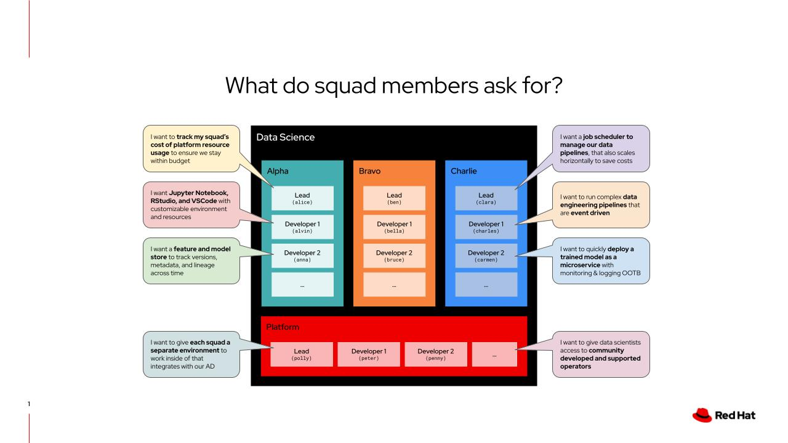

# mobb-demos

### Demos
[microservices-demo (Online Boutique)
](#microservices-demo-online-boutique)\
[rhods-demo (Red Hat OpenShift Data Science)
](#rhods-demo-red-hat-openshift-data-science)

All of the demos have been tested on new ROSA and ARO clusters. If you need a new ROSA or ARO cluster, you can use the instructions below.

### Create a new ROSA Cluster

```console
# PREREQUISITES: Verify your AWS CLI and ROSA CLI are authenticated, and AWS account roles exist
# -------------- All of the calls below must return succesfully in order to proceed
aws sts get-caller-identity
rosa whoami
rosa create user-role --mode auto --yes
rosa create account-roles --mode auto --yes

# REQUIRED HUMAN INPUT: Provide a unique name for your cluster
export CLUSTER_NAME=

# Create a cluster (accept all defaults)
rosa create cluster \
  --cluster-name $CLUSTER_NAME \
  --sts \
  --region us-west-2 \
  --availability-zones us-west-2a
  --version 4.13.3 \
  --replicas 2 \
  --compute-machine-type c6a.xlarge \
  --machine-cidr 10.0.0.0/16 \
  --service-cidr 172.30.0.0/16 \
  --pod-cidr 10.128.0.0/14 \
  --host-prefix 23 \
  --mode auto \
  --yes

# You may have to create roles and OIDC provider
rosa create operator-roles --cluster $CLUSTER_NAME --mode auto --yes
rosa create oidc-provider --cluster $CLUSTER_NAME --mode auto --yes

# Wait for the cluster to become ready (ctrl-c to cancel watch)
rosa logs install -c $CLUSTER_NAME --watch

# Create your cluster-admin user and 
# follow the instructions in the response to login to the cluster using the oc command
rosa create admin --cluster $CLUSTER_NAME
oc login https://... --username cluster-admin --password 12345-...

# Remove the self-provisioner role from all authenticated users to revoke default behaviour of project creation from authenticated users
oc adm policy remove-cluster-role-from-group self-provisioner system:authenticated:oauth

# Retrieve the OpenShift Web Console address and log in with your cluster-admin account
oc whoami --show-console
```

At this point, you should have:

* access to your ROSA cluster via command line
* access to your ROSA cluster via Web Console
* visibility of your ROSA cluster in the [Red Hat OpenShift Console](https://console.redhat.com/openshift/)

### Create a new ARO Cluster

```
lorem ipsum
```

---

## Demos

### microservices-demo (Online Boutique)

The Online Boutique is a cloud-first microservices demo application. Online Boutique consists of an 11-tier microservices application. The application is a web-based e-commerce app where users can browse items, add them to the cart, and purchase them. [Source](https://github.com/GoogleCloudPlatform/microservices-demo/tree/452f60d92d40dfea997f3d5d429d09896461b65e)

```console
cd microservices-demo
oc new-project microservices-demo
oc adm policy add-scc-to-user anyuid -n microservices-demo -z default
oc apply -f ./release/kubernetes-manifests.yaml
```

---

### rhods-demo (Red Hat OpenShift Data Science)

[Install RHODS operator](https://access.redhat.com/documentation/en-us/red_hat_openshift_data_science_self-managed/1.26/html/installing_openshift_data_science_self-managed/installing-openshift-data-science-on-openshift-container-platform_install) and follow along a scenario that aims to solve the challenges for a theoretical data science organization: 



```console
# REQUIRED HUMAN INPUT: Provide a common password for our 12 users, keep it simple which will help with demo pacing
export HTPASSWD_PASS=
touch htpasswd-rhods
echo $(htpasswd -B -n -b alice $HTPASSWD_PASS) | tee -a htpasswd-rhods > /dev/null
echo $(htpasswd -B -n -b alvin $HTPASSWD_PASS) | tee -a htpasswd-rhods > /dev/null
echo $(htpasswd -B -n -b anna $HTPASSWD_PASS) | tee -a htpasswd-rhods > /dev/null
echo $(htpasswd -B -n -b ben $HTPASSWD_PASS) | tee -a htpasswd-rhods > /dev/null
echo $(htpasswd -B -n -b bella $HTPASSWD_PASS) | tee -a htpasswd-rhods > /dev/null
echo $(htpasswd -B -n -b bruce $HTPASSWD_PASS) | tee -a htpasswd-rhods > /dev/null
echo $(htpasswd -B -n -b clara $HTPASSWD_PASS) | tee -a htpasswd-rhods > /dev/null
echo $(htpasswd -B -n -b charles $HTPASSWD_PASS) | tee -a htpasswd-rhods > /dev/null
echo $(htpasswd -B -n -b carmen $HTPASSWD_PASS) | tee -a htpasswd-rhods > /dev/null
echo $(htpasswd -B -n -b polly $HTPASSWD_PASS) | tee -a htpasswd-rhods > /dev/null
echo $(htpasswd -B -n -b peter $HTPASSWD_PASS) | tee -a htpasswd-rhods > /dev/null
echo $(htpasswd -B -n -b penny $HTPASSWD_PASS) | tee -a htpasswd-rhods > /dev/null

# Create htpasswd-rhods secret with the 12 new users
oc create secret generic htpasswd-secret-rhods --from-file=htpasswd=htpasswd-rhods -n openshift-config

# Update existing oauth configuration with new htpasswd source of users
oc get oauth cluster -o yaml > oauth.yaml
yq '.spec.identityProviders |= [{"htpasswd": {"fileData": { "name": "htpasswd-secret-rhods"}}, "mappingMethod": "claim", "name": "htpasswd-rhods", "type": "HTPasswd"}] + .' -i oauth.yaml
oc replace -f oauth.yaml

# Wait for the oauth pods to be replaced (ctrl-c to exit)
watch oc get all -n openshift-authentication

# Create 4 new projects, for our alpha, bravo, charlie, and platform squads
oc new-project datascience-alpha
oc new-project datascience-bravo
oc new-project datascience-charlie
oc new-project datascience-platform

# Add users to groups
oc adm groups new datascience-alpha alice alvin anna
oc adm groups new datascience-bravo ben bella bruce
oc adm groups new datascience-charlie clara charles carmen
oc adm groups new datascience-platform polly peter penny

# Add roles to groups for each project
oc adm policy add-role-to-group edit datascience-alpha -n datascience-alpha
oc adm policy add-role-to-group edit datascience-platform - n datascience-alpha
oc adm policy add-role-to-group edit datascience-bravo -n datascience-bravo
oc adm policy add-role-to-group edit datascience-platform -n datascience-bravo
oc adm policy add-role-to-group edit datascience-charlie -n datascience-charlie
oc adm policy add-role-to-group edit datascience-platform -n datascience-charlie
oc adm policy add-role-to-group edit datascience-platform -n datascience-platform

# Label the alpha, bravo, and charlie projects (namespace) so that the RHODS operator picks them up
oc label namespace datascience-alpha opendatahub.io/dashboard=true
oc label namespace datascience-alpha modelmesh-enabled=true
oc label namespace datascience-bravo opendatahub.io/dashboard=true
oc label namespace datascience-bravo modelmesh-enabled=true
oc label namespace datascience-charlie opendatahub.io/dashboard=true
oc label namespace datascience-charlie modelmesh-enabled=true
```
